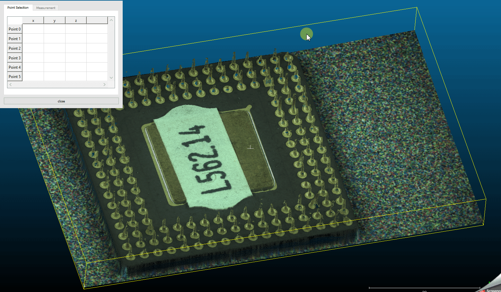
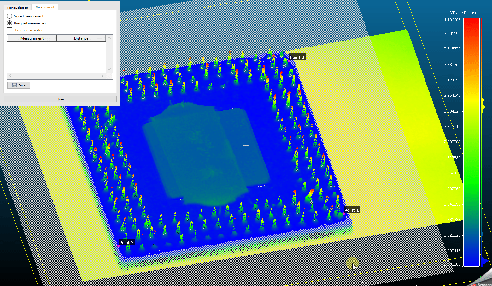

# MPlane Plugin
**MPlane** is a plugin for [CloudCompare](https://github.com/CloudCompare/CloudCompare) to perform normal distance measurements against a defined plane.

## Basic workflow
1.  Fit a plane through a point cloud by selecting at minimum 3 reference points. A scalarfield for visualizing the normal distance is created and applied automatically.

2.  Perform normal distance measurements against the plane.

3.  Save measurements as a .csv file.  
 
    CSV Header | Explanation
    ------------ | -------------  
    measurement | The name of the measurement point
    x-coord | x coordinate of the measurement point
    y-coord | y coordinate of the measurement point
    z-coord | z coordinate of the measurement point
    distance | Normal distance from the measurement point to the plane

## Copyright
AIT Austrian Institute of Technology GmbH  
[https://www.ait.ac.at/](https://www.ait.ac.at/)